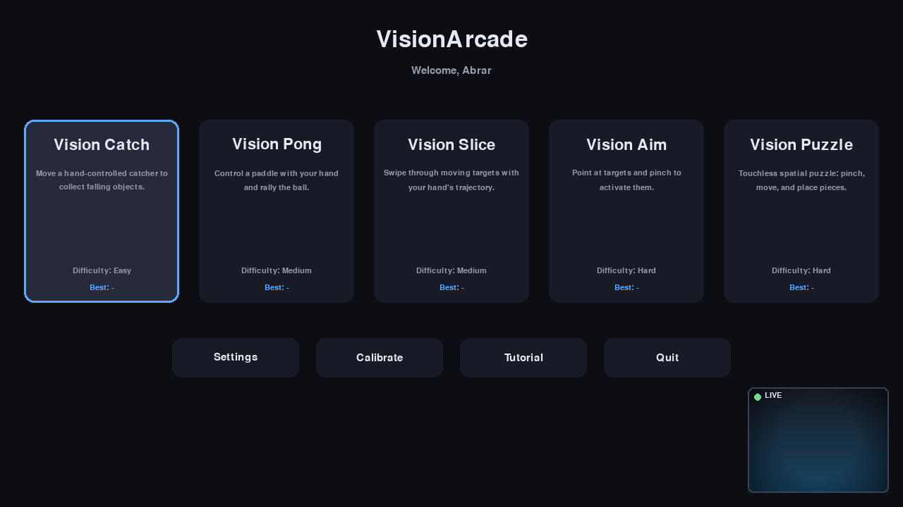
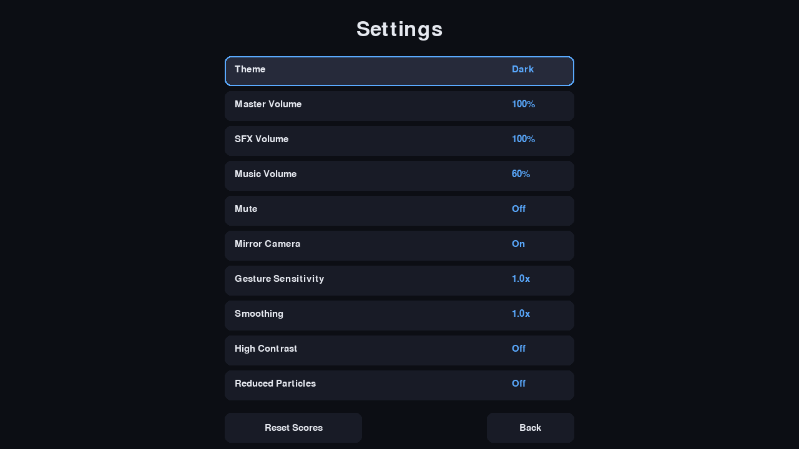
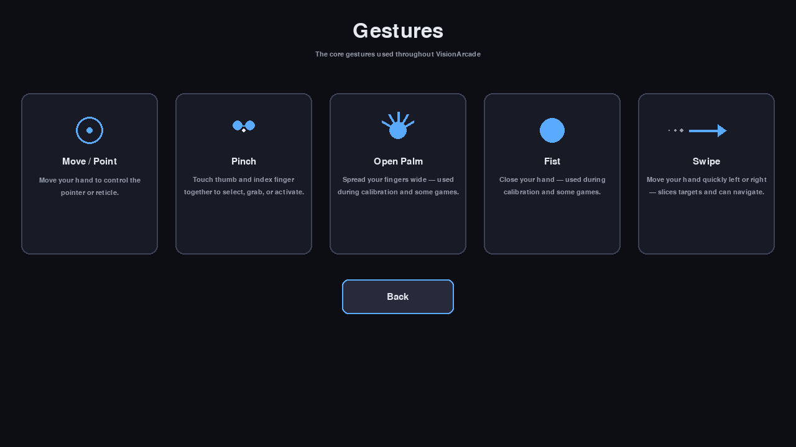
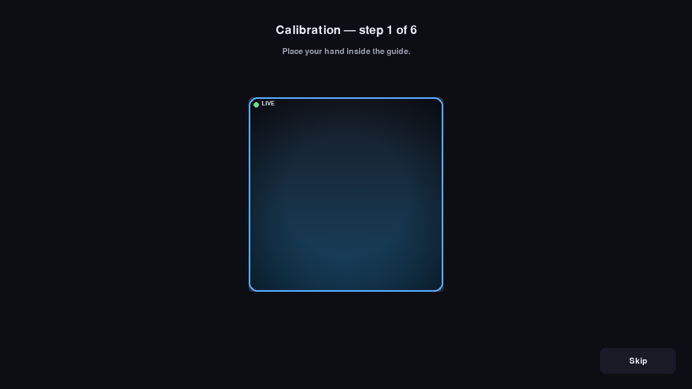
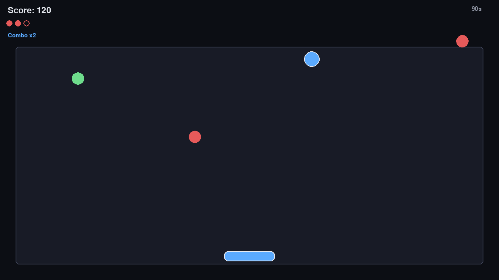
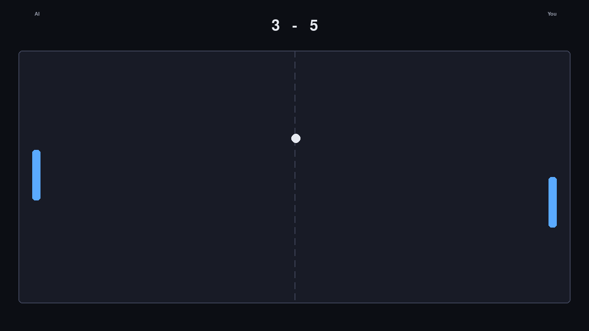
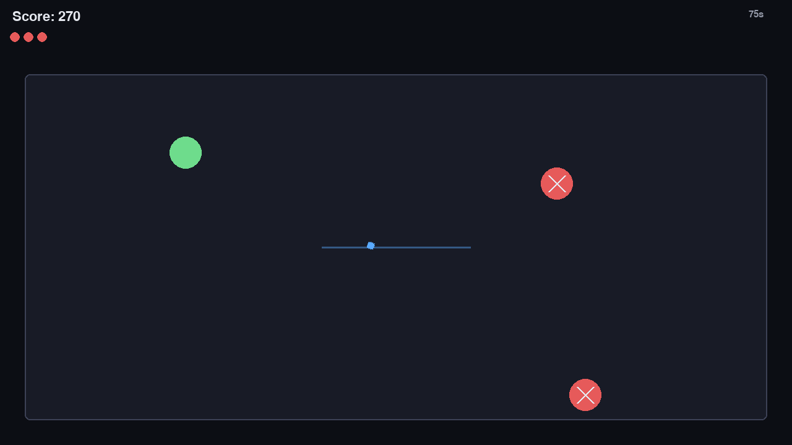
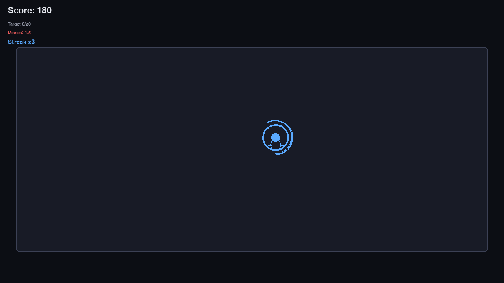
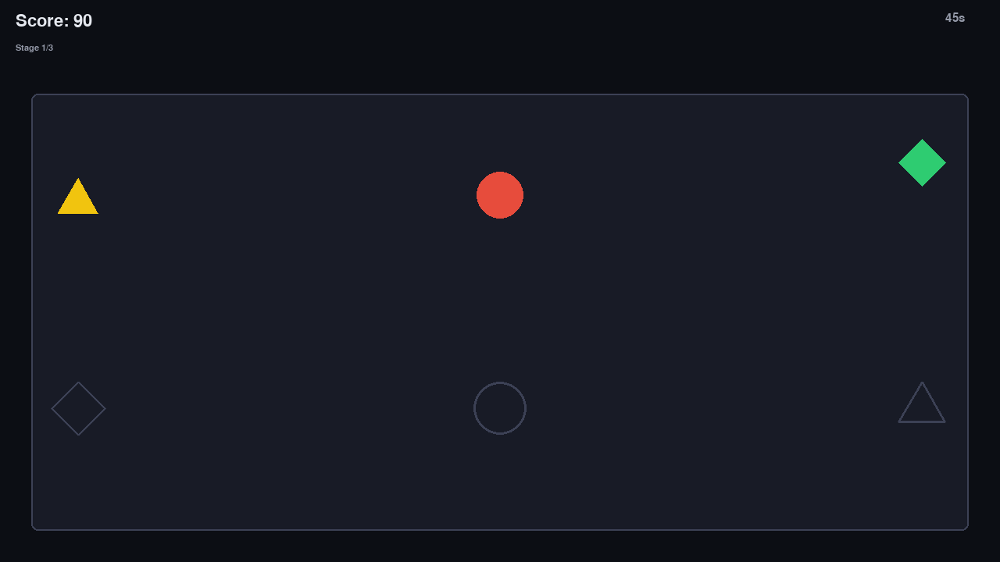
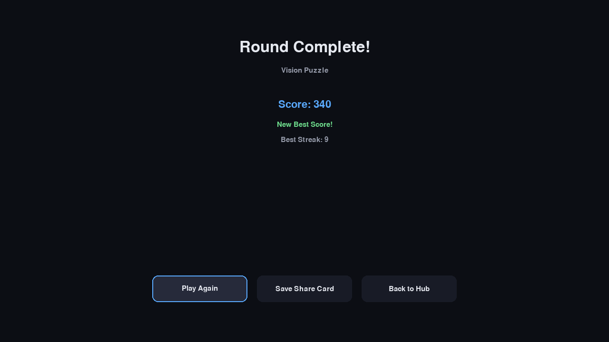

# VisionArcade

**A real-time, touchless arcade where computer vision becomes the controller.**

Five fully playable mini-games, controlled entirely by webcam-tracked hand
gestures — no mouse or touchscreen during gameplay. Point, pinch, and swipe
your way through a home hub, calibrate your own reach and hand size, and
watch your score, combo, and progress update live.



---

## Table of Contents

1. [Overview](#overview)
2. [Feature Highlights](#feature-highlights)
3. [Architecture](#architecture)
4. [Gesture & Control Reference](#gesture--control-reference)
5. [The Games](#the-games)
6. [Screenshots](#screenshots)
7. [Installation](#installation)
8. [Running VisionArcade](#running-visionarcade)
9. [Calibration Guide](#calibration-guide)
10. [Troubleshooting](#troubleshooting)
11. [Testing](#testing)
12. [Project Structure](#project-structure)
13. [Design Decisions](#design-decisions)
14. [Post-Launch Fixes](#post-launch-fixes)
15. [Known Limitations](#known-limitations)
16. [Roadmap](#roadmap)

---

## Overview

VisionArcade turns a webcam into a game controller. The design philosophy
running through every layer of the codebase is a single pipeline:

```
Camera → Vision → Gesture/Intent → Game Input → Game State → Animation/Audio → Feedback
```

Raw camera frames become MediaPipe hand landmarks, which become stabilized,
resolution-independent interaction signals (position, pinch, openness,
velocity, swipe), which become game-ready input — and no individual game
ever touches a camera frame or a raw landmark directly. That separation is
what let five very different games (a catcher, a paddle game, a slicer, an
aim trainer, and a spatial puzzle) share one camera pipeline, one settings
system, one audio manager, and one pause/results flow without duplicating
any of it.

## Feature Highlights

- **Five genuinely playable games** — Catch, Pong, Slice, Aim, and Puzzle —
  each with a countdown, difficulty progression, combo/streak scoring,
  clear win/loss feedback, and a results summary.
- **Touchless-first, keyboard-accessible everywhere.** Every menu — the
  hub, settings, pause, results, even Pong's in-game mode picker — works
  by pointing and pinching *or* with arrow keys and Enter. Gameplay itself
  never needs a keyboard.
- **A real gesture pipeline, not a demo.** Debounced pinch states
  (START/HOLD/RELEASE), hysteresis on hand presence, frame-rate-independent
  smoothing, and swipe detection that checks a hand's whole motion segment
  each frame, not just where it happened to be sampled.
- **First-run calibration** that personalizes the coordinate mapping to
  your own reach, with a graceful fallback if skipped or degenerate.
- **Persistent settings, scores, and profile** — all tolerant of a
  partially corrupted save file (one bad score entry doesn't wipe your
  history).
- **Four themes** (dark/light/neon/mono), with high-contrast mode, adjustable
  gesture sensitivity and smoothing, a reduced-particles mode, and full
  keyboard fallback — accessibility features that are actually wired into
  gameplay, not just present in a settings menu.
- **A developer/debug mode** (`--simulate`) that replaces the camera with a
  keyboard-controlled virtual hand, so every game can be played, tested,
  and demoed without a webcam at all.
- **Local share cards** — a one-click PNG summary of your round, generated
  with Pillow.

## Architecture

```
visionarcade/
├── app.py                 Entry point, main loop, camera/simulator wiring
├── config.py               CLI parsing → AppConfig
├── constants.py             Every tunable constant in the project
│
├── vision/                  Camera → landmarks → stabilized intent
│   ├── camera.py             Webcam capture, graceful failure/retry
│   ├── tracker.py             MediaPipe Hands wrapper (Tasks API)
│   ├── landmarks.py            Typed landmark data (no raw MediaPipe leaks out)
│   ├── features.py              Stateless geometry: pinch distance, openness, palm center
│   ├── smoothing.py               Exponential smoothing + hysteresis gate
│   ├── motion.py                   Velocity tracking + swipe detection
│   ├── gestures.py                  IntentBuilder: raw detections → stabilized FrameIntent
│   ├── calibration.py               Calibration data model, session, safe persistence
│   └── simulation.py                Keyboard-driven fake hand for --simulate / tests
│
├── arcade/                   The game engine
│   ├── manager.py             ArcadeManager: owns every screen and the game registry
│   ├── game.py                  ArcadeGame — the interface every game implements
│   ├── state.py                   ArcadeState enum (HOME, PLAYING, PAUSED, RESULTS, …)
│   ├── input.py                    FrameIntent → play-area pixel space + button edges
│   ├── scoring.py                   ScoreTracker, ComboTracker (shared by every game)
│   ├── difficulty.py                 DifficultyCurve — one linear ramp, reused everywhere
│   ├── collision.py                   circle/rect/segment collision helpers
│   └── games/                          catch.py, pong.py, slice.py, aim.py, puzzle.py
│
├── rendering/                Presentation layer
│   ├── renderer.py             Window lifecycle, event pump
│   ├── themes.py                 dark/light/neon/mono palettes
│   ├── typography.py              Cached, named type scale + text wrapping
│   ├── hud.py                       Shared score/lives/combo/timer overlay
│   ├── particles.py                  Seedable particle-burst system
│   ├── transitions.py                 Shell-level fade between screens
│   └── share_card.py                   Pillow-based PNG round summary
│
├── audio/                    manager.py (mixer + volume), effects.py (named SFX)
├── persistence/               settings.py, scores.py, profiles.py, storage.py (shared safe JSON I/O)
├── ui/                         home.py, settings.py, calibration.py, tutorial.py,
│                                pause.py, results.py, navigation.py (shared FocusGroup)
├── utils/                       paths.py (cross-platform dirs), assets.py (asset cache)
└── tests/                        500+ tests, headless, deterministic
```

No individual game module imports OpenCV, MediaPipe, or `pygame.camera` —
every game only ever sees a `FrameIntent` (from `handle_intent`) and a
`dt` (from `update`). That single rule is what makes "add a sixth game"
mean "write one file and register one factory line," not "touch the
camera loop."

## Gesture & Control Reference

| Gesture | What it does | Used in |
|---|---|---|
| **Move / Point** | Moves the pointer, reticle, catcher, or paddle | Every screen and game |
| **Pinch** (thumb + index touch) | Select / activate / grab | Menus, Aim, Puzzle |
| **Pinch + drag + release** | Grab and place | Puzzle |
| **Open palm** | Calibration step; some games' openness checks | Calibration |
| **Fist** | Calibration step | Calibration |
| **Swipe left/right** | Slice a target; a future menu-navigation gesture | Slice |
| **Two hands** | Independent left/right paddle or piece control | Pong (2-player), Puzzle |

Keyboard fallback (works everywhere a gesture does): **Arrow keys** move
focus, **Enter/Space** activates, **Escape** goes back (or pauses during
gameplay). `--simulate` mode adds arrow-key hand movement and Space as a
pinch, so the whole app is playable with no camera at all.

## The Games

| Game | Objective | Difficulty progression | Win/loss |
|---|---|---|---|
| **Vision Catch** | Move a catcher to collect falling objects, avoid hazards | Fall speed & spawn rate ramp over a 90s round | Out of lives, or round cleared |
| **Vision Pong** | Rally the ball past your opponent | Ball speed ramps over the match *and* per rally; AI gets faster | First to 7 points |
| **Vision Slice** | Swipe through arcing targets, avoid bombs | Launch speed & spawn rate ramp over a 75s round | Out of lives, or round cleared |
| **Vision Aim** | Point and pinch each target before its timer expires | Per-target time limit shrinks across a 20-target sequence | 5-miss budget, or sequence cleared |
| **Vision Puzzle** | Pinch-grab-drag-release pieces onto matching slots | 3 stages, each with more pieces and less time | Time runs out, or all 3 stages cleared |

Every game shares the same shell: a countdown, a pause menu
(Resume/Restart/Quit to Hub — quitting mid-round still saves your score),
and a results screen (score, best-streak/accuracy/reaction-time as
relevant, a "New Best!" callout, Play Again, Save Share Card, Back to Hub).

## Screenshots

| | |
|---|---|
|  Home hub |  Settings |
|  Tutorial |  Calibration |
|  Vision Catch |  Vision Pong |
|  Vision Slice |  Vision Aim |
|  Vision Puzzle |  Results |

These are genuine renders of the actual application (captured headlessly,
not mockups) — every screen and game pictured above runs exactly like this.

## Installation

Requires Python 3.10+.

```bash
git clone <this-repo>
cd visionarcade
pip install -r requirements.txt
```

**Dependencies** (all in `requirements.txt`):

| Package | Why |
|---|---|
| `opencv-python` | Webcam capture, frame preprocessing (mirroring) |
| `mediapipe` | Hand landmark detection (Tasks API) |
| `numpy` | Frame/array handling |
| `pygame` | Window, rendering, input, audio |
| `Pillow` | Share-card PNG generation |
| `pytest` | Test suite |

MediaPipe's hand-tracking model (`hand_landmarker.task`, a few MB) is
downloaded automatically on first run and cached locally — no manual
download step.

## Running VisionArcade

```bash
python main.py                # normal launch
python main.py --debug        # verbose logging + on-screen intent/FPS overlay
python main.py --camera 1     # use a different camera device
python main.py --game catch   # (reserved for future direct-launch support)
python main.py --simulate     # no camera: keyboard-controlled virtual hand
python main.py --simulate --debug
```

In `--simulate` mode: **arrow keys** move the virtual hand, **Space**
pinches. Every game and menu is fully playable this way.

## Calibration Guide

The first time you calibrate (Home → Calibrate, or any time to
re-calibrate), you'll be walked through six steps:

1. **Place your hand** inside the on-screen guide box.
2. **Move it around** — left, right, up, down — for a few seconds, covering
   your comfortable range of motion.
3. **Pinch** your thumb and index finger together.
4. **Open your palm** wide.
5. **Swipe** — a short, quick motion to either side.
6. Done — your personalized mapping is saved automatically.

Calibration remaps *your* comfortable movement range to the full screen,
so someone with a smaller range of motion still reaches every corner. If
you skip calibration, or your movement during step 2 was too small to be
meaningful, VisionArcade falls back to a sane default range automatically
— calibration is never required to play.

## Troubleshooting

**"Camera unavailable" / no hand tracking.** VisionArcade degrades
gracefully rather than crashing — check that no other application is
using the camera, that your OS has granted camera permission to the
terminal/app running Python, and try `python main.py --camera 1` (or
`2`, etc.) if you have multiple cameras. You can always fall back to
`--simulate` to keep testing/playing without one.

**Hand tracking works but feels laggy or jittery.** Try adjusting
**Sensitivity** and **Smoothing** in Settings — more smoothing trades a
little responsiveness for stability; less smoothing feels snappier but
noisier. Re-running calibration can also help if your camera distance or
lighting changed.

**No sound.** Audio fails silently by design (a missing device or asset
should never crash the app) — check Settings for Mute/volume, and check
your OS's own output device selection. The app will run normally with
audio unavailable.

**First launch is slow.** The MediaPipe hand-tracking model downloads on
first use (a few MB) and is cached afterward — this only happens once,
and requires an internet connection the very first time.

**Window doesn't appear / crashes on launch.** Confirm `pygame` installed
correctly for your platform (`pip show pygame`), and that you're on
Python 3.10+.

## Testing

```bash
pytest
```

500+ tests, all headless (pygame's dummy video/audio drivers — no real
window or camera needed) and deterministic (every source of randomness —
spawn timing, target placement, AI aim error, particle bursts — is
seeded via an injected `random.Random`). Coverage includes:

- Every vision-layer concern called out in the project's testing
  requirements: coordinate normalization, smoothing, the pinch state
  machine, swipe detection, gesture hysteresis.
- Scoring, combo/streak decay, and difficulty-curve math.
- Collision helpers (circle-rect, point-to-rect distance, segment-circle
  for Slice's blade path).
- Persistence, including corrupted-save-file recovery for settings,
  scores, and profile independently.
- Full game-state-machine coverage for all five games (countdown → play
  → pause → results → win/loss, for every outcome each game can reach).
- **End-to-end tests** that play a real round of every single game
  through the actual `app.py` main loop — real camera-absence handling,
  real gesture smoothing, real touchless menu selection — with nothing
  mocked below the OS event queue.

## Project Structure

See [Architecture](#architecture) above for the annotated module tree.
Tests live in `tests/`, one file per module they cover, plus
`test_app_smoke.py` for the end-to-end app-level tests and
`test_arcade_manager.py` for shell-level integration tests.

## Design Decisions

**Why temporal smoothing?** A hand held perfectly still still produces
different landmark coordinates frame to frame — camera noise, tiny
tremor, MediaPipe's own frame-to-frame variance. Feeding that raw signal
directly into game logic means a stationary hand would still make a
reticle vibrate and a paddle twitch. `vision/smoothing.py` applies a
frame-rate-independent exponential moving average, so the *effective*
amount of smoothing is the same whether the game runs at 30fps or
144fps — a fixed per-frame blend factor would look and feel completely
different at different frame rates.

**Why normalized, resolution-independent coordinates?** MediaPipe already
reports landmark positions normalized to the input frame's own
resolution. Calibration remaps that into a *personalized* [0, 1] space
based on each player's actual reach — a value of 0.5 always means "the
center of your calibrated range," never "exactly 320 pixels," so the
same game logic works identically at any window size or camera
resolution without a single game needing to know either.

**Why an intent abstraction (`FrameIntent`) instead of exposing raw
landmarks to games?** Two reasons. First, decoupling: every game would
otherwise need its own pinch-detection math, its own hysteresis, its own
"is this actually a swipe" logic — exactly the duplication Engineering
Rule #3 exists to prevent. Second, and more concretely, it's what makes
`--simulate` mode work at all: `SimulatedHandInputSource` produces the
exact same `HandResult` shape a real camera would, so every game, menu,
and test downstream of `IntentBuilder` runs through *identical* code
whether the input is a webcam or a keyboard. Games never know the
difference, and neither does the test suite.

## Post-Launch Fixes

Real hands-on testing (with an actual webcam, which this project's own
development environment never had) surfaced three issues, all now fixed:

1. **No live camera feed.** The calibration screen showed only an
   instructional guide box, and there was no camera view anywhere else
   in the app — making it hard to understand what the system was
   seeing. Fixed with a real `CameraView` component (cover-fit
   scaling/cropping, a smooth vignette, a live/no-signal status badge):
   calibration now shows your actual camera feed filling the guide
   box, and a small persistent preview appears in the corner of every
   other screen.
2. **Vision Pong's two-player mode couldn't be selected.** Two
   compounding bugs: the mode-select menu used `intent.primary()`,
   which always prefers the right hand — so pointing with your *left*
   hand (natural for a game about using both hands) had its pinch
   silently ignored whenever the right hand was also visible. Separately,
   activation only checked the single exact frame a pinch transitioned
   to `START`; a real pinch involves slight hand drift while closing
   the fingers, so the pointer often wasn't over the button on that
   precise frame. Fixed by checking both hands independently and
   accepting `START` or `HOLD`.
3. **Vision Puzzle pieces wouldn't grab reliably.** The same
   single-exact-frame issue as above — grabbing was only attempted on
   the precise frame `pinch_state` flipped to `START`. Fixed the same
   way (accept `START` or `HOLD`), and widened the grab radius
   (40px → 55px) for more forgiving real-world precision.

All three are covered by new regression tests (`test_camera_view.py`,
and new cases in `test_pong_game.py` and `test_puzzle_game.py`) that
specifically reproduce the bug scenario before asserting the fix.

## Known Limitations

In the interest of an honest final accounting rather than a polished-sounding
omission:

- **The camera preview shows the feed itself, not a tracked-hand
  overlay.** The original design brief also describes a gesture label
  and confidence indicator drawn directly on the camera view. The feed
  is now real and live (see Post-Launch Fixes above); the overlay
  annotations on top of it are not yet built.
- **`--game <name>` direct-launch** is accepted by the CLI parser but
  does not yet skip the hub — it launches the app at the home screen
  regardless of the value passed. Selecting the game from the hub works
  identically either way.
- **Pong's "2-player" mode** requires both hands to be simultaneously
  visible to the camera at comfortable positions on opposite sides of
  frame; this can be physically awkward depending on camera placement.
  It is fully implemented and tested, but is the one mode most sensitive
  to a given webcam's field of view.
- **Vision Puzzle does not support piece rotation** via wrist/hand
  orientation, one of the original design brief's suggested "advanced"
  options (explicitly marked "if robust" in that brief). The vision
  pipeline's stabilized `HandIntent` has no orientation signal, and
  adding one would mean extending the whole pipeline for a single
  optional feature; shape-and-color matching is a complete puzzle
  without it.

## Roadmap

- A tracked-hand overlay, gesture label, and confidence indicator drawn
  directly on the camera view (the feed itself is live now — see Known
  Limitations above).
- `--game <name>` direct-launch actually bypassing the hub.
- Two-hand gesture vocabulary (spread-to-zoom, two-hand pinch) for a
  possible sixth game.
- Bundled, licensed audio assets (the audio manager and every hook are
  in place and tested against silence; no SFX/music files are bundled).
- Packaged, double-clickable builds (e.g. via PyInstaller) for macOS/
  Windows/Linux, rather than requiring `python main.py`.
